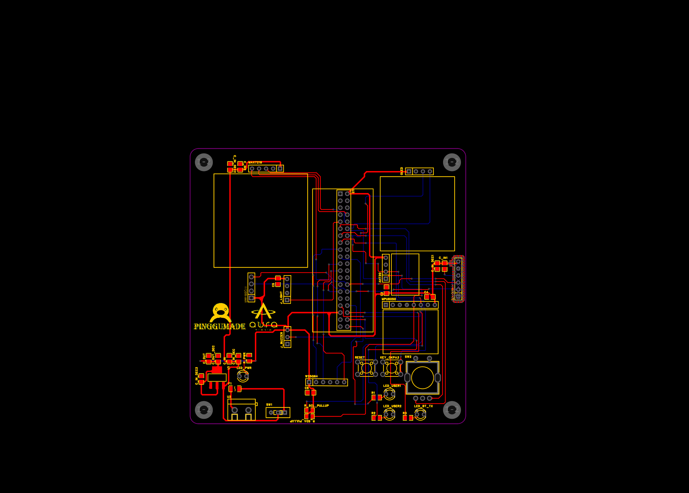
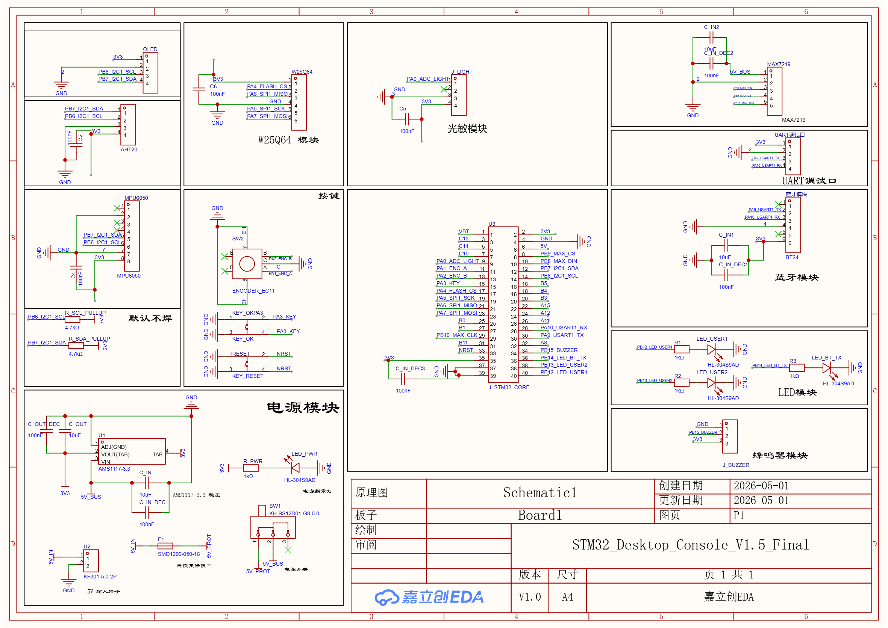
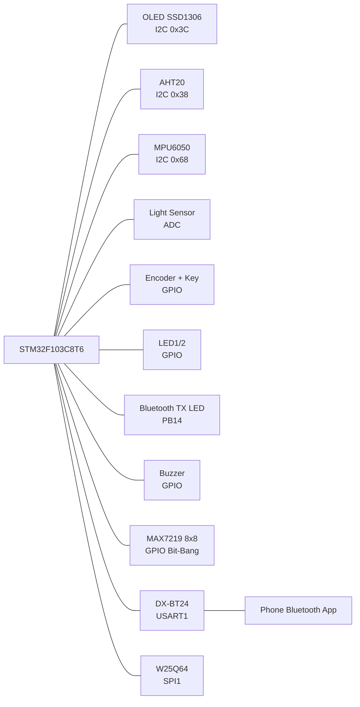

# 基于 STM32F103C8T6 的多传感器蓝牙桌面控制终端

## 1. 项目简介

本项目是一个基于 STM32F103C8T6 的模块化桌面控制终端，当前版本为 **V1.4 面包板验证版**。

系统集成了 OLED 菜单显示、旋转编码器/按键交互、AHT20 温湿度检测、光敏 ADC 采集、MPU6050 姿态/震动检测、LED 控制、操作提示音/静音模式、MAX7219 8x8 点阵图标、DX-BT24 蓝牙串口通信、手机蓝牙命令控制、W25Q64 历史数据记录与蓝牙导出功能。

项目主要面向 STM32 初学者，适合作为 HAL 库、I2C、SPI、USART、ADC、GPIO、非阻塞任务调度和简单菜单系统的综合练习项目。

## Hardware Documents

- [Hardware Overview](hardware/README.md)
- [Pinout](docs/pinout.md)
- [Hardware Debug Notes](docs/hardware_debug_notes.md)
- [Assembly Notes](hardware/manufacturing/assembly_notes.md)
- [LCSC Parts List](hardware/bom/lcsc_parts.md)

## PCB Preview



## Schematic Preview



## 2. 功能特点

- 使用 STM32F103C8T6 最小系统板作为主控。
- 使用 STM32CubeMX 生成 HAL 工程。
- OLED SSD1306 显示多级页面和状态信息。
- 旋转编码器用于菜单选择，独立按键用于进入/返回页面。
- AHT20 采集温度和湿度。
- 光敏模块通过 ADC 采集环境光强。
- MPU6050 采集三轴加速度，并实现简单震动检测。
- 2 个普通 LED 支持 OFF、ON、BLINK 三种模式。
- PB14 作为蓝牙发送指示灯，每次向手机发送数据时短暂点亮。
- 有源蜂鸣器支持操作提示音和静音模式，也可通过蓝牙命令单独测试。
- MAX7219 8x8 点阵显示当前状态图标。
- DX-BT24 蓝牙串口支持手机查看状态和发送控制命令。
- W25Q64 SPI Flash 保存历史记录，支持蓝牙导出。
- 主循环采用 HAL_GetTick() 实现非阻塞刷新，不使用 RTOS。

## 3. 硬件清单

| 名称 | 型号/说明 | 数量 |
| --- | --- | --- |
| 主控板 | STM32F103C8T6 最小系统板 | 1 |
| OLED 显示屏 | SSD1306，0.96 寸，128x64，I2C | 1 |
| 温湿度传感器 | AHT20，I2C | 1 |
| 光敏模块 | AO 模拟输出 | 1 |
| 姿态传感器 | MPU6050，I2C | 1 |
| 蓝牙模块 | DX-BT24 串口蓝牙 | 1 |
| 点阵模块 | MAX7219 8x8 点阵 | 1 |
| SPI Flash | W25Q64 | 1 |
| 旋转编码器 | A/B/SW 三引脚输出 | 1 |
| LED | 普通 LED 或 LED 模块，PB12/PB13 为普通 LED，PB14 为蓝牙发送指示灯 | 3 |
| 蜂鸣器 | 有源蜂鸣器，低电平触发 | 1 |
| 面包板和杜邦线 | 用于 V1.4 验证 | 若干 |

## 4. 引脚分配表

| 模块 | 引脚/信号 | STM32 引脚 | 说明 |
| --- | --- | --- | --- |
| OLED SSD1306 | SCL | PB6 | I2C1_SCL |
| OLED SSD1306 | SDA | PB7 | I2C1_SDA |
| AHT20 | SCL | PB6 | 与 OLED 共用 I2C1 |
| AHT20 | SDA | PB7 | 与 OLED 共用 I2C1 |
| MPU6050 | SCL | PB6 | 与 OLED/AHT20 共用 I2C1 |
| MPU6050 | SDA | PB7 | 与 OLED/AHT20 共用 I2C1 |
| DX-BT24 | RXD | PA9 | USART1_TX |
| DX-BT24 | TXD | PA10 | USART1_RX |
| 光敏模块 | AO | PA0 | ADC1_IN0 |
| 旋转编码器 | A/CLK | PA1 | GPIO 输入上拉 |
| 旋转编码器 | B/DT | PA2 | GPIO 输入上拉 |
| 按键 | SW | PA3 | GPIO 输入上拉，按下接 GND |
| W25Q64 | CS | PA4 | GPIO 输出，默认高电平 |
| W25Q64 | SCK | PA5 | SPI1_SCK |
| W25Q64 | MISO | PA6 | SPI1_MISO |
| W25Q64 | MOSI | PA7 | SPI1_MOSI |
| MAX7219 | DIN | PB8 | GPIO 模拟时序 |
| MAX7219 | CS/LOAD | PB9 | GPIO 模拟时序 |
| MAX7219 | CLK | PB10 | GPIO 模拟时序 |
| LED1 | 控制脚 | PB12 | GPIO 推挽输出 |
| LED2 | 控制脚 | PB13 | GPIO 推挽输出 |
| Bluetooth TX LED | 控制脚 | PB14 | 蓝牙发送指示灯，发送数据时短暂点亮 |
| 蜂鸣器 | 控制脚 | PB15 | 低电平触发，默认高电平 |

I2C 地址：

| 模块 | 地址 |
| --- | --- |
| OLED SSD1306 | 0x3C |
| AHT20 | 0x38 |
| MPU6050 | 0x68 |

## 5. 系统框图



## 6. CubeMX 配置说明

### 6.1 基础配置

- MCU：STM32F103C8T6
- Project：STM32CubeIDE 工程
- Firmware Package：STM32Cube FW_F1
- Library：HAL
- SYS Debug：Serial Wire

### 6.2 时钟配置

当前工程使用外部 8 MHz 晶振：

- HSE：8 MHz
- PLL：x9
- SYSCLK：72 MHz
- APB1：36 MHz
- APB2：72 MHz
- ADC Prescaler：/6
- ADC Clock：12 MHz

如果使用没有外部晶振的最小系统板，也可以改用 HSI，但时钟精度会低一些，串口波特率误差可能变大。建议初学者优先使用带 8 MHz HSE 的常见最小系统板。

### 6.3 外设配置

| 外设 | 配置 |
| --- | --- |
| I2C1 | PB6=SCL，PB7=SDA，100 kHz |
| USART1 | PA9=TX，PA10=RX，9600，8N1，开启 USART1 global interrupt |
| ADC1 | PA0=ADC1_IN0 |
| SPI1 | Full-Duplex Master，PA5/PA6/PA7 |
| GPIO Input | PA1/PA2/PA3，上拉输入 |
| GPIO Output | PA4、PB8、PB9、PB10、PB12、PB13、PB14、PB15 |

GPIO 默认电平建议：

- PA4：W25Q64 CS，默认高电平。
- PB15：蜂鸣器低电平触发，默认高电平。
- PB12/PB13：普通 LED 初始关闭。
- PB14：蓝牙发送指示灯初始关闭。
- PB9：MAX7219 CS/LOAD，默认高电平。

## 7. 软件架构

项目按模块拆分，便于初学者逐步理解和维护。

| 文件 | 作用 |
| --- | --- |
| `main.c` | CubeMX 主入口，初始化外设后调用 `App_Init()` 和 `App_Loop()` |
| `app.c/.h` | 应用状态机，菜单页面逻辑，模块调度 |
| `ui.c/.h` | OLED 页面绘制 |
| `oled.c/.h` | SSD1306 OLED 驱动 |
| `encoder.c/.h` | 编码器和按键轮询扫描 |
| `aht20.c/.h` | AHT20 温湿度传感器驱动 |
| `sensors.c/.h` | 温湿度和光敏 ADC 数据管理 |
| `mpu6050.c/.h` | MPU6050 初始化和加速度读取 |
| `buzzer.c/.h` | 蜂鸣器非阻塞短响、操作提示音开关 |
| `bluetooth.c/.h` | 蓝牙串口接收、命令解析、状态发送、PB14 发送指示灯 |
| `max7219.c/.h` | MAX7219 GPIO 模拟时序和图标显示 |
| `w25q64.c/.h` | W25Q64 SPI Flash 底层驱动 |
| `history.c/.h` | 历史记录保存、读取、清空 |

主循环采用类似任务轮询的方式运行：

```c
int main(void)
{
  HAL_Init();
  SystemClock_Config();
  MX_GPIO_Init();
  MX_ADC1_Init();
  MX_I2C1_Init();
  MX_USART1_UART_Init();
  MX_SPI1_Init();

  App_Init();

  while (1)
  {
    App_Loop();
  }
}
```

## 8. 菜单说明

OLED 主菜单包含以下页面：

| 菜单项 | 功能 |
| --- | --- |
| Temp&Humi | 显示 AHT20 温度和湿度 |
| Light | 显示 ADC 光敏原始值和光照等级 |
| LED Control | 切换 PB12/PB13 的 OFF / ON / BLINK |
| Beep Mode | 设置操作提示音 BEEP ON / BEEP OFF |
| Bluetooth | 每 2 秒发送状态数据 |
| Motion | 显示 MPU6050 AX/AY/AZ 和震动状态 |
| History | 显示历史记录数量和最近一条记录 |

交互方式：

- 旋转编码器：切换菜单项，在 LED Control 页面切换 LED 模式，在 Beep Mode 页面切换提示音开关。
- 按键短按：在主菜单进入页面，在页面内返回主菜单。
- 操作提示音：进入页面、返回菜单、LED 模式改变、Beep Mode 状态改变、蓝牙有效命令执行成功时短响；BEEP OFF 时不响。
- 页面刷新使用 `HAL_GetTick()` 定时，不使用长时间阻塞延时。

## 9. 蓝牙命令表

蓝牙模块使用 USART1，波特率 9600。命令以 CR、LF 或 CRLF 结尾。

为了避免手机串口工具中文编码不一致，本项目 V1.4 的蓝牙命令和回复均使用 ASCII。命令不区分大小写，支持前后空格和多个连续空格。

### 9.1 基础命令

| 英文命令 | 拼音别名 | 说明 |
| --- | --- | --- |
| `HELP` | `BANGZHU` | 查看命令列表 |
| `STATUS` | `ZHUANGTAI` | 获取温湿度、光照、LED 和 BEEP 状态 |
| `LED ON` | `KAIDENG` | 打开 PB12/PB13 |
| `LED OFF` | `GUANDENG` | 关闭 PB12/PB13 |
| `LED BLINK` | `SHANDENG` | PB12/PB13 闪烁 |
| `BUZZER` | `FENGMING` | 测试蜂鸣器，忽略静音模式 |
| `BEEP ON` | `FENGMING ON` | 开启操作提示音 |
| `BEEP OFF` | `FENGMING OFF` | 关闭操作提示音，进入静音模式 |
| `BEEP TOGGLE` | `JINGYIN` | 切换操作提示音状态 |
| `GET MOTION` | `ZITAI` | 获取 MPU6050 姿态/震动数据 |
| `SAVE NOW` | `BAOCUN` | 立即保存一条历史记录 |
| `HISTORY STATUS` | `JILU ZHUANGTAI` / `JILUZHUANGTAI` | 查看历史记录状态 |
| `GET HISTORY` | `DAOCHU JILU` / `DAOCHUJILU` | 导出历史记录 |
| `CLEAR HISTORY` | `QINGKONG JILU` / `QINGKONGJILU` | 清空历史记录 |

### 9.2 图标命令

| 英文命令 | 拼音别名 | 说明 |
| --- | --- | --- |
| `ICON SMILE` | `TUBIAO XIAOLIAN` / `TUBIAOXIAOLIAN` | 显示笑脸图标 |
| `ICON TEMP` | `TUBIAO WENDU` / `TUBIAOWENDU` | 显示温度图标 |
| `ICON LIGHT` | `TUBIAO GUANGZHAO` / `TUBIAOGUANGZHAO` | 显示光照图标 |
| `ICON LED` | `TUBIAO DENG` / `TUBIAODENG` | 显示 LED 图标 |
| `ICON BUZZER` | `TUBIAO FENGMING` / `TUBIAOFENGMING` | 显示蜂鸣器图标 |
| `ICON BT` | `TUBIAO LANYA` / `TUBIAOLANYA` | 显示蓝牙图标 |
| `ICON ERROR` | `TUBIAO CUOWU` / `TUBIAOCUOWU` | 显示错误图标 |

### 9.3 回复格式

| 命令 | 回复示例 |
| --- | --- |
| `HELP` | `AVAILABLE COMMANDS:` 后跟命令列表，最后 `OK` |
| `STATUS` | `TEMP=25.6,HUMI=60.2,LIGHT=1234,LED=ON,BEEP=ON`，然后 `OK` |
| `GET MOTION` | `AX=12,AY=-35,AZ=16384,SHAKE=0`，然后 `OK` |
| `HISTORY STATUS` | `RECORDS=10,WRITE_INDEX=10`，然后 `OK` |
| `GET HISTORY` | 多行 `REC ...`，最后 `OK` |
| 未知命令 | `ERR UNKNOWN CMD` |
| 命令过长 | `ERR CMD TOO LONG` |
| Flash 不可用 | `ERR FLASH` |

## 10. 历史记录功能说明

W25Q64 用于保存传感器历史数据。当前 V1.4 采用简单固定区域记录方式，适合面包板验证和学习使用。

每条记录包含：

- 记录序号
- 温度
- 湿度
- 光敏 ADC 原始值
- MPU6050 AX、AY、AZ
- 震动状态

记录策略：

- 最多保存最近 100 条记录。
- 每 10 秒自动保存一条记录。
- 可通过 `SAVE NOW` 或 `BAOCUN` 立即保存。
- 可通过 `GET HISTORY` 或 `DAOCHUJILU` 导出。
- 可通过 `CLEAR HISTORY` 或 `QINGKONGJILU` 清空。
- 如果 Flash 初始化失败，系统其他功能仍可正常工作。

导出示例：

```text
REC 1,T=25.6,H=60.2,L=1234,AX=12,AY=-35,AZ=16384,SHAKE=0
REC 2,T=25.7,H=60.1,L=1240,AX=15,AY=-30,AZ=16380,SHAKE=1
OK
```

## 11. 调试步骤

建议按以下顺序逐步调试，不要一次接入所有模块：

1. 确认 STM32F103C8T6 最小系统板可以正常下载程序。
2. 确认 SYS Debug 设置为 Serial Wire，避免占用 SWD 下载引脚。
3. 单独调试 OLED，确认菜单可以显示。
4. 接入旋转编码器和按键，确认菜单可切换、可进入页面。
5. 接入 AHT20，确认 Temp&Humi 页面有数据。
6. 接入光敏模块，确认 Light 页面 ADC 值变化。
7. 接入 LED 和蜂鸣器，确认输出控制正常。
8. 确认 Beep Mode 页面可以切换 `BEEP: ON/OFF`。
9. 接入 DX-BT24，先做串口收发测试，再测试命令，并观察 PB14 发送指示灯。
10. 接入 MAX7219，确认图标可切换。
11. 接入 MPU6050，确认 AX/AY/AZ 有变化。
12. 接入 W25Q64，确认 `HISTORY STATUS`、`SAVE NOW`、`GET HISTORY` 正常。

蓝牙调试建议：

- 手机串口 App 选择普通 ASCII 显示即可。
- 波特率设置为 9600。
- 发送命令时建议开启追加换行，或手动发送 CR/LF。
- 如果主动状态发送正常，但手机命令无响应，优先检查 USART1 RX 中断是否开启。

## 12. 常见问题

### 12.1 OLED 没有显示

- 检查 OLED 地址是否为 0x3C。
- 检查 PB6/PB7 是否接反。
- 检查 I2C1 是否配置为 100 kHz。
- 检查 OLED 电源是 3.3 V 还是 5 V 兼容。

### 12.2 AHT20 或 MPU6050 读取失败

- 检查 I2C 地址：AHT20 为 0x38，MPU6050 通常为 0x68。
- 检查 I2C 总线上是否有上拉电阻。
- 多个 I2C 模块共线时，线不要太长。
- MPU6050 的 AD0 接 GND 或悬空时一般为 0x68。

### 12.3 蓝牙可以发送状态，但手机命令无响应

- 检查 DX-BT24 TXD 是否接 STM32 PA10。
- 检查 DX-BT24 RXD 是否接 STM32 PA9。
- 检查 CubeMX 是否启用 USART1 global interrupt。
- 检查 `Bluetooth_Init()` 是否在 `MX_USART1_UART_Init()` 之后调用。
- 确认发送命令带有 CR 或 LF 结束符。

### 12.4 蓝牙中文乱码

V1.4 已经改为英文和拼音 ASCII 命令，不再发送中文。建议使用：

- `HELP`
- `BANGZHU`
- `STATUS`
- `ZHUANGTAI`

### 12.5 W25Q64 记录失败

- 检查 PA4 是否作为 CS，默认高电平。
- 检查 SPI1 的 SCK/MISO/MOSI 接线。
- 检查 W25Q64 供电是否为 3.3 V。
- Flash 写入前需要 Write Enable，擦除按 4 KB sector 操作。

### 12.6 蜂鸣器一直响

- 本项目使用低电平触发蜂鸣器。
- PB15 默认应输出高电平。
- 如果模块触发电平不同，需要修改蜂鸣器驱动逻辑。
- 如果 Beep Mode 设置为 `BEEP OFF`，普通操作不会响；`BUZZER` / `FENGMING` 命令仍可用于硬件测试。

### 12.7 PB14 不随 LED Control 闪烁

- V1.4 后 PB14 已改为蓝牙发送指示灯。
- LED Control 页面只控制 PB12 和 PB13。
- 每次 STM32 通过蓝牙发送数据时，PB14 会短暂点亮约 80 ms。

## 13. 版本更新记录

| 版本 | 内容 |
| --- | --- |
| V1.0 | 完成 OLED 菜单、编码器、AHT20、光敏 ADC、LED、蜂鸣器、蓝牙状态发送 |
| V1.1 | 增加 MAX7219 8x8 点阵状态图标 |
| V1.3 Step1 | 增加手机蓝牙命令控制 LED、蜂鸣器和图标 |
| V1.3 Step2 | 增加 MPU6050 Motion 页面和 `GET MOTION` 命令 |
| V1.4 | 增加 W25Q64 历史记录、蓝牙导出，并将蓝牙命令整理为英文/拼音 ASCII |
| V1.4 调整版 | Buzzer 页面改为 Beep Mode，增加操作提示音开关；PB14 改为蓝牙发送指示灯；STATUS 增加 BEEP 状态 |

## 14. 后续计划

- 将面包板验证版整理为 PCB 版本。
- 优化历史记录存储格式，增加掉电保护和 CRC 校验。
- 增加更清晰的手机端控制界面。
- 增加低功耗模式或屏幕休眠功能。
- 增加更多 MAX7219 图标和告警提示。
- 对菜单 UI 进行进一步整理。

## 15. 开源许可建议

建议使用 MIT License 开源。

MIT License 比较适合个人学习项目和硬件 Demo 项目，允许他人自由使用、修改和二次开发，同时保留作者声明。发布到 GitHub 时可以添加 `LICENSE` 文件；发布到立创开源广场时，也可以在项目说明中注明：

```text
本项目建议采用 MIT License 开源，仅供学习和交流使用。
```

如果项目后续用于商业产品或教学资料，建议根据实际需求重新选择许可证。
